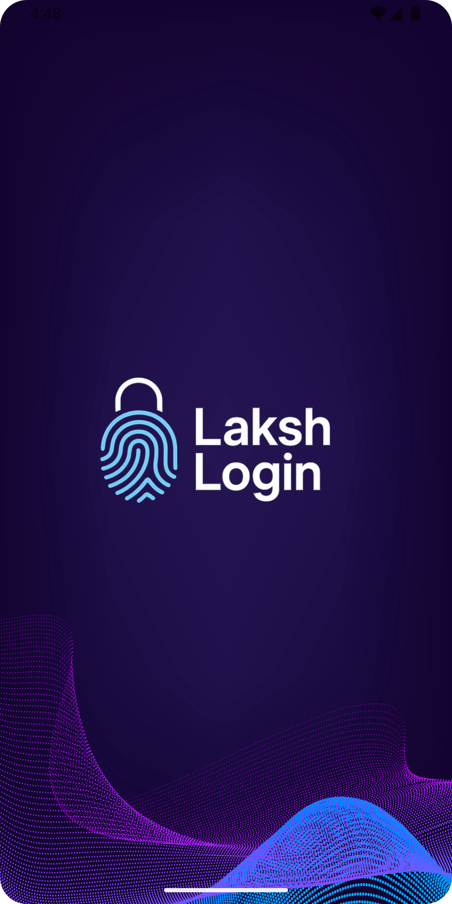
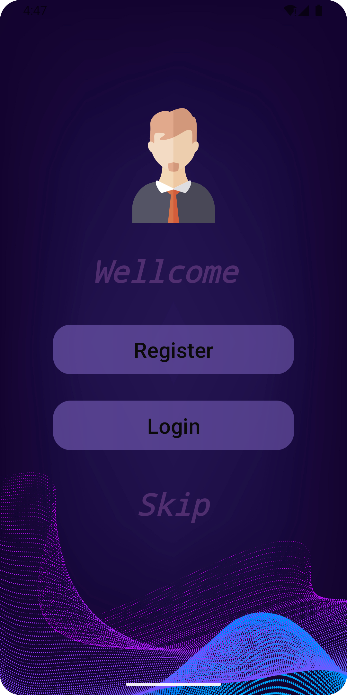

# Login Application

A simple Android application built using Java and XML that provides a basic **Login and Sign-Up interface**. This app can be used as a **starter template** for any new Android application requiring user authentication.

---

## ✨ Features

- 📱 Simple and clean UI using XML
- 🧾 User sign-up form to register
- 🔐 Login screen for user authentication
- ✅ Basic validation and navigation
- 🔄 Can be extended to include Firebase or backend integration

---

## 🚀 Technologies Used

- Java (Android)
- XML Layouts
- AndroidX Libraries

---

## 📷 Screenshots

> (Add your actual screenshots below in this section once available)

| Splash Screen        | Option Screen        | Sign-Up Screen       | Login Screen         |
|----------------------|----------------------|----------------------|----------------------|
|  |  |  |  |

---

## 📦 How to Use

1. Clone this repository  

2. Open the project in **Android Studio**

3. Build and run the project on an emulator or real device

---

## 🧑‍💻 Ideal For

This project is great for:
- Beginners practicing Android UI
- Developers who want a reusable login/sign-in interface
- Jump-starting a new app with user auth basics

---

## 📌 Notes

- No backend is currently connected.
- You can extend it with Firebase Authentication or REST API for real user management.

---

## 📧 Contact

For any queries, suggestions, or improvements, feel free to reach out!

---

